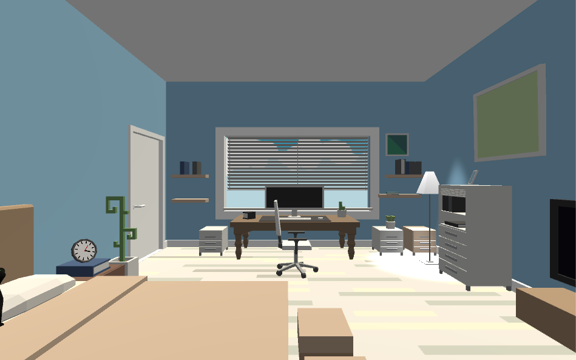

# CartoomHome
> stay simple, stay young

> made by unity 2018.3.10f1

> 2019.4.9

- [x] **技术点预研**
    - [x] 全屏后处理，黑白，眨眼等效果
    - [x] 灯光亮度以及太阳光的timeline使用
    - [x] bgm切换播放
    - [x] 第三人称镜头
    - [x] 第一人称镜头
    - [x] 旋转门的交互
    - [x] 布料效果模拟以及风场模拟

- [x] **五月初demo**
    - [x] 将功能整合到一个室内场景中
    - [x] 可交互模块（移动和摄像机）
        - [x] 角色移动处理
        - [x] 摄像机跟随以及镜头处理
    - [x] 灯光以及其他交互效果整合
        - [x] 太阳光与灯光
        - [x] 窗帘以及风场
        - [x] 各种门的交互
    - [x] 做完一个完整流程

- [ ] **后续优化**
    - [ ] 使用配置文件配置整个剧情流程
